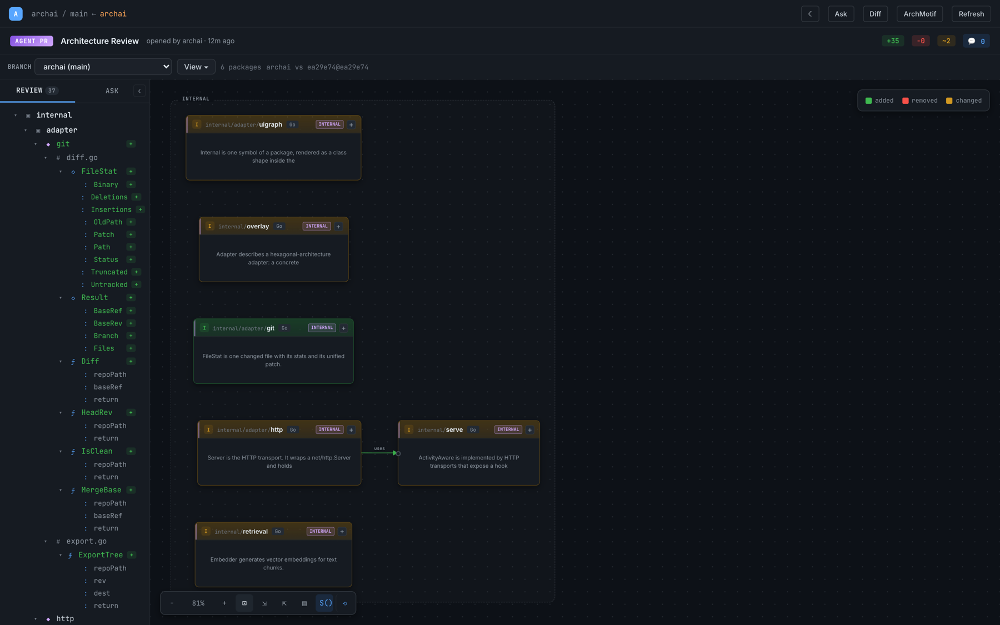
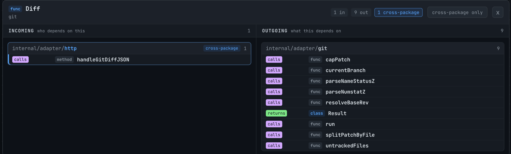
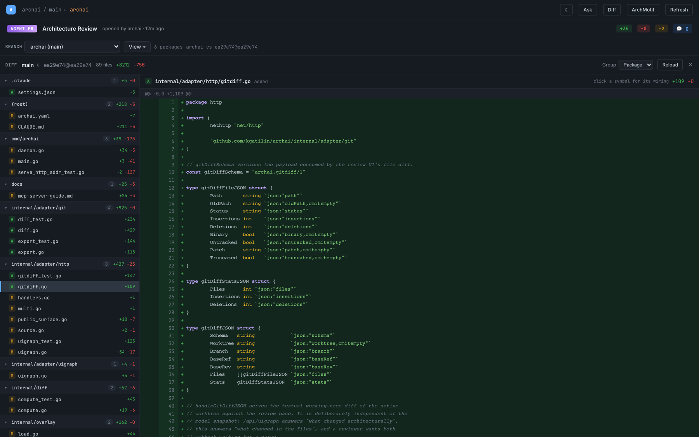
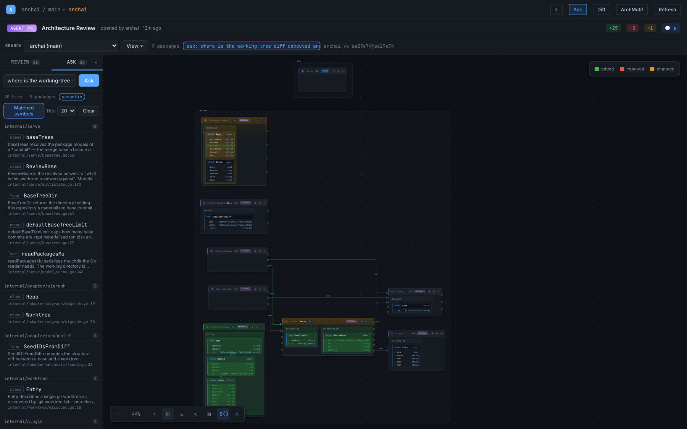

# archai

**Review a branch as architecture. The lines stay one click away.**

archai parses a Go repository into a typed code graph — packages, files, types,
functions, and the `calls` / `implements` / `usesType` / `returns` edges between
them — keeps that graph live in a local daemon, and serves it to three audiences
from one process:

| Audience | Surface | What they get |
|---|---|---|
| **People** | Browser review UI | The branch drawn as packages and symbols, with the patch one click away. |
| **Agents** | 26 MCP tools | The same graph, queried before the agent greps. Search, callers, implementers, analysis lenses. |
| **CI** | `archai-check` | 8.9 MB, no Node, exit 1 on a layer violation or a forbidden dependency. |



---

## Why

Two days of agent commits on this repository: 19 commits, **89 files, +8,212
−756**. The tests pass — the agent ran them. You are not going to read that
diff. Nobody is.

Here is the same branch as archai sees it:

- **6 packages touched**, of 39
- **1 new package** — `internal/adapter/git`
- **+35 symbols added**, ~2 changed, 0 removed
- **1 new dependency** between packages

That is a review you can finish. The lines never go away — click any symbol and
its patch opens on it.

---

## Install

The review UI is compiled into `archai` from `web/dist` — a build artifact, not
committed — so the full binary is built from source. Needs Go 1.25+ and npm:

```bash
git clone https://github.com/kgatilin/archai.git
cd archai
make build      # npm build, then go build → bin/archai
```

`archai-check` embeds nothing, so it installs directly:

```bash
go install github.com/kgatilin/archai/cmd/archai-check@main
```

> **Do not use `@latest`.** The module path is `github.com/kgatilin/archai`
> with no `/v2` suffix while the tags are `v2.x`, so the Go proxy ignores every
> one of them and `@latest` resolves to **v1.9.0** — old enough to predate
> `archai daemon`, which is how a fresh install ends up without half the
> commands. `go install` cannot produce the full `archai` at all yet, for the
> embed reason above. Both are being fixed; build from source meanwhile.

### Embeddings need Ollama

Semantic search, `Ask`, `semantic_cluster` and `latent_domains` run on vector
embeddings, and archai builds those locally against [Ollama](https://ollama.com).
It is the one external dependency, and it is optional:

```bash
brew install ollama && ollama serve      # or your platform's install
ollama pull qwen3-embedding:0.6b         # the default model
```

That is all the setup there is — a daemon on `localhost:11434` with the model
pulled, and archai indexes the repo on its own. Nothing leaves the machine.

Without it archai still parses the graph, draws the review, answers the
structural lenses and runs the CI gates; search degrades to lexical BM25 and the
two embedding-backed lenses decline to run rather than guess. `archai graph
status` says which state you are in (`dense_available`).

Point it elsewhere with environment variables:

| Variable | Default | Meaning |
|---|---|---|
| `ARCHAI_EMBED_PROVIDER` | `ollama` | `ollama`, `openai`, or `noop` |
| `ARCHAI_EMBED_ENDPOINT` | `http://localhost:11434` | Server to embed against |
| `ARCHAI_EMBED_MODEL` | `qwen3-embedding:0.6b` | Embedding model |
| `ARCHAI_EMBED_API_KEY` | — | Required by the `openai` provider; read from env only |
| `ARCHAI_EMBED_DISABLE` | — | `1` turns embedding off entirely |

`openai` targets any OpenAI-compatible `/v1/embeddings` endpoint. Selecting it
without an API key falls back to no embeddings and says so, rather than crashing
the daemon.

## Sixty seconds

```bash
cd your-go-repo
archai daemon start     # parses the repo, prints the review URL
```

Open the printed URL. That is your current worktree, diffed against `main`,
drawn as architecture. Nothing to configure, no `archai.yaml` required.

Pin the port in `archai.yaml` so the URL survives a restart:

```yaml
serve:
  http_addr: "127.0.0.1:47823"
```

Manage the daemon with `archai daemon status | list | restart | stop`.

---

## The review UI

The daemon serves a review at `/w/<worktree>/review/`: the branch as
architecture, with every step down to the source kept one click deep.

**The canvas.** Changed packages as cards; symbols inside them coloured added /
changed / removed; edges for the dependencies the branch introduced. The `View`
menu controls focus (`Changed packages` → `Changed + linked` → `Whole repo`),
which change kinds are visible (additions, removals, changed signatures,
dependency changes), and how much of each package to draw (`Changed symbols` vs
`Full package`). The left rail is the same review as a tree.

Each file panel on a card carries two buttons: `<>` opens that file in the
source drawer — on every panel, because a card you reached by searching has no
diff at all — and `±` opens its patch in the file diff, on the panels the
review painted as changed. Both name the file the same way the drawer does, so
no surface can disagree about which file a card means.

**Symbol wiring.** Click a symbol and you get its first-level relations, drawn
as package blocks: who depends on it on the left, what it depends on on the
right. Cross-package neighbours are accent-bordered, tagged, and sorted first —
that is usually the finding. Each row re-anchors the panel on itself, so depth
is walked one hop at a time instead of exploding into a hairball.



**The file diff.** `Diff` in the app bar opens the changed-file list sectioned
by package next to the selected file's patch, both sides numbered and syntax
highlighted. The diff is three-dot from `merge-base(base, HEAD)` and ends at the
**working tree**, so a branch still reads correctly after `main` moves ahead and
uncommitted agent work shows up without a commit. Untracked files are included
as additions — a review that hides new files is a trap.

Every identifier in a patch that the graph can resolve is clickable and opens
its wiring over the diff, so "what uses this?" is answered without leaving the
file.



**Ask.** Put a question to the same hybrid retrieval index the MCP `search` tool
uses; the answer comes back as ranked hits in the rail *and* as the packages
those hits live in, drawn on the canvas narrowed to the matched symbols. It
answers "where is X handled" as architecture instead of as a file list.



**Call sequences.** An expanded card flips to a Mermaid-subset sequence diagram
of the call flow rooted at a symbol — lifelines are types, one column per callee,
cross-package lifelines marked. Backward (right-to-left) calls carry their own
colour, and column gaps are solved per pair so one long label cannot stretch the
diagram to 68,000 pixels.

**Structural metrics.** The `ArchMotif` panel reports layering score, cycles,
fan-in/fan-out and instability per package, and flags god-packages.

---

## For agents: MCP or CLI

The graph has two front doors onto the same daemon, and an agent can use either.

```bash
archai serve --mcp-stdio      # MCP over stdio, for an MCP-capable client
archai graph <tool> [flags]   # the same tools/call, from any shell
```

Neither computes anything locally: both proxy a `tools/call` to the repo-level
daemon, so they see one parsed model and return the same payload. `archai graph
status` prints byte-for-byte what the MCP `status` tool returns.

| | MCP | `archai graph` |
|---|---|---|
| Wiring | `.mcp.json` | the binary on `PATH` |
| Call | tool call | `archai graph <tool> --flag …` |
| Arguments | JSON matching the tool's input schema | typed flags mirroring that same schema |
| Result | ToolResult text | the same text, verbatim |
| Coverage | 26 tools | 23 of them |

Use MCP when the agent has an MCP client. Use the CLI when it has a shell and
nothing else — a git hook, a CI step, a `codex exec` one-liner, a tmux-driven
agent, or you at a prompt. Neither is a degraded mode of the other.

### Wiring MCP

```json
{
  "mcpServers": {
    "archai": {
      "command": "archai",
      "args": ["serve", "--mcp-stdio", "--root", "."]
    }
  }
}
```

The thin client attaches to (or starts) the repo-level daemon, so every worktree
and every agent shares one parsed model. Works with Claude Code, Codex, or any
MCP client.

### Wiring the CLI

```bash
archai daemon start                       # once per repo
archai graph status                       # readiness, before anything else

archai graph search --query "working-tree diff" --k 5
archai graph get_node --id internal/adapter/git.Diff
archai graph expand --node internal/adapter/git.Diff --edge calls --hops 1
archai graph trophic_layers --package internal/adapter
archai graph latent_domains --package internal/adapter/mcp

archai graph search --daemon uagent --query "retry policy"   # another repo's daemon
```

Every subcommand carries typed flags built from its tool's input schema, and
`--daemon <name|pid>` reaches a daemon other than the current repo's.

**Why an agent should reach for either before `grep`:** the graph returns
architecture. Callers, implementers, the edge that crosses a package boundary —
none of that is a text search result.

### Tools

| Group | Tools | CLI |
|---|---|---|
| Inspect | `list_packages`, `get_package`, `get_node`, `extract` | yes |
| Search | `search` (hybrid dense + BM25), `search_graph` (graph diffusion), `expand` | yes |
| Analysis lenses | `components`, `file_hotspots`, `trophic_layers`, `spectral_cluster`, `semantic_cluster`, `latent_domains` | yes |
| Overlay | `list_bounded_contexts`, `get_bounded_context` | yes |
| Index | `status`, `refresh`, `embedding_coverage` | yes |
| File access | `read_file`, `search_files` | — a shell has `cat` and `grep` |

File access is two of the three tools with no CLI twin — they exist for MCP
clients that have no filesystem tools of their own, and a shell needs neither.
The third takes a YAML patch body, which belongs in a file rather than a flag.

### The analysis lenses

These are the ones worth knowing about; each takes a package and optionally its
subpackages.

- **`trophic_layers`** — emergent layers from dependency *direction*, with no
  policy file. Solves a graph Laplacian for a trophic height per node and reports
  an incoherence score `F0 ∈ [0,1]` (~0 layered, >0.4 tangled), integer layers,
  backward edges (inversions), and cycles.
- **`spectral_cluster`** — natural module clusters over structural edges. Auto-K
  is modularity-validated, not gap-picked, so a hairball does not silently return
  a degenerate K=3.
- **`semantic_cluster`** — the same spectral core over a kNN graph of embedding
  similarity: clusters by what code is *about* rather than how it is wired.
- **`latent_domains`** — clusters both ways and compares the partitions with
  Adjusted Mutual Information. When structure and semantics diverge, real domains
  exist but are fused by a cross-cutting concern; the lens names the **glue** —
  the shared helpers to pull to a thin boundary.
- **`file_hotspots`** — declarations per file, flagging god-files at
  `≥ max(3× median, 20)`.
- **`components`** — connected components over all edges. Singletons mean
  something is unlinked.

### Search is a diffusion over the graph

`search` runs a dense pass and a BM25 pass and calibrates both onto a comparable
mass before combining them, so a hit's score reflects how good the match was
rather than only where it ranked. `search_graph` then spends that mass on the
graph: seeds are personalized in proportion to their relevance and a
min-conductance sweep cut (Andersen–Chung–Lang) returns the community those hits
sit in. The region is query-adaptive, the cut's cost comes back as
`conductance` — a "did this query find anything coherent" signal — and edge
weights are divided by endpoint degrees so paths through glue nodes stop
collecting mass on every query. Design notes:
[`docs/features/search-diffusion/design.md`](docs/features/search-diffusion/design.md).

Vectors are content-addressed and cached per repository under
`~/.arch/embeddings/`, so a fresh worktree re-parses but does not re-embed.

Indexing never blocks the transport: a cold daemon answers
`{status: "loading"}` or `{status: "indexing", embedded, embeddable}` right
away. Poll `status` and retry.

---

## For CI: `archai-check`

```bash
archai-check all       # layer rules + dependency policy
archai-check overlay   # layer rules only
archai-check policy    # dependency policy only
```

Each command exits non-zero when its gate fails and prints the offending edges,
one per line.

```yaml
- uses: actions/setup-go@v5
  with:
    go-version-file: go.mod
- run: go run github.com/kgatilin/archai/cmd/archai-check@main all   # not @latest — see Install
```

The gates live in `internal/check` and are shared with `archai overlay check`
and `archai policy check`, so the binary you run locally and the binary CI runs
cannot disagree about what passes. This repository gates itself the same way —
see `.github/workflows/ci.yml` and `make archai-check`.

### Declaring the rules

Layers and their permitted dependencies go in `archai.yaml`:

```yaml
module: github.com/kgatilin/archai

layers:
  domain:         [internal/domain/...]
  application:    [internal/service/..., internal/overlay/..., internal/diff/...]
  infrastructure: [internal/serve/..., internal/target/...]
  adapters:       [cmd/..., internal/adapter/...]

layer_rules:
  domain:         []
  application:    [domain]
  infrastructure: [application, domain, adapters]
  adapters:       [infrastructure, application, domain]
```

A dependency **policy** states invariants directly, including transitive
reachability, in either blacklist or deny-by-default mode:

```yaml
policy:
  deny_by_default: false
  forbid:
    - "@domain !-> @application, @infrastructure, @adapters"
  reachability:
    - "@domain !~> @adapters"
```

### Two binaries, on purpose

| Binary | Contents | Size |
|---|---|---|
| `archai` | Code graph, MCP server, review UI, diagram generation and rendering | ~49 MB (~36 MB stripped) |
| `archai-check` | The architecture gates only | ~8.9 MB (~6 MB stripped) |

One dependency explains the split: `oss.terrastruct.com/d2`'s SVG renderer
alone — a JavaScript interpreter for the dagre layout, embedded fonts, chroma —
measures ~30 MB. `archai-check` links neither it nor the embedded review UI,
which is also why it builds on a machine with no Node.js installed.

---

## D2 diagrams

archai still does what it originally did: turn Go packages into D2 class
diagrams.

```bash
archai diagram generate ./internal/...              # pub.d2 + internal.d2 per package
archai diagram generate ./internal/... --pub        # exported symbols only
archai diagram generate ./... -o architecture.d2    # one combined diagram
archai diagram split docs/architecture.d2           # combined → per-package specs
archai diagram compose ./internal/... --spec --output docs/spec.d2
```

Output lands in each package's `.arch/` directory. Symbols carry stereotypes —
`<<interface>>`, `<<struct>>`, `<<factory>>` (a `New*` function), `<<function>>`,
`<<enum>>` — and their colours are overridable in `archai.yaml`:

```yaml
diagrams:
  d2:
    styles:
      factory:
        container_fill: "#edf8ed"
        class_fill: "#256d3f"
        class_font_color: "#fff"
```

Render with the [D2 CLI](https://d2lang.com/): `d2 --watch architecture.d2`.

---

## How it works

```
                                ┌─▶ review UI       people
Go source ──▶ typed code graph ─┼─▶ 26 MCP tools    agents
  go/packages · re-parsed       └─▶ archai-check    CI
```

```
pkg ─contains→ file ─contains→ type | func
type ─contains→ method | field
fn/method ─calls | usesType | returns→ type | fn      (behavioural flow)
struct ─implements→ interface
```

A node id is just `<package>.<Symbol>` — `internal/adapter/git.Diff`. The same
string is the key in the retrieval index, the id of the row on the review
canvas, and the argument to `get_node` / `expand`, so a search hit is a card
lookup and nothing in the stack has to translate between the two.

Internally archai is hexagonal: domain models with no dependencies at the
centre, a service layer over ports, adapters for each format (Go reader, D2
writer, git, HTTP, MCP, YAML overlay), and the CLI doing the wiring. It gates
itself on those rules in CI.

### Language scope

Go today. The seam for another language is a single port:

```go
type ModelReader interface {
    Read(ctx context.Context, paths []string) ([]domain.PackageModel, error)
}
```

Everything past that port — the graph, the architecture diff, the file diff, the
review UI, wiring, sequences, ask, the MCP tools, the analysis lenses, layer
rules, the CI gate — is language-blind. A new language is a new reader.
A Java reader lived behind this port and was removed without touching anything
to the right of it.

---

## Documentation

| Doc | Covers |
|---|---|
| [`docs/user-guide.md`](docs/user-guide.md) | Installation, quick start, project setup, browser UI, editor integration |
| [`docs/mcp-server-guide.md`](docs/mcp-server-guide.md) | MCP transport, server modes, tool reference, agent workflows |
| [`docs/retrieval.md`](docs/retrieval.md) | Retrieval service: chunking, embedders, hybrid search |
| [`docs/roadmap.md`](docs/roadmap.md) | What is not built yet |

## Development

```bash
make build          # full archai (runs the web build first)
make build-check    # archai-check only — no npm needed
make test           # go test ./...
make archai-check   # the gate CI runs, run locally
```

`archai` embeds `web/dist`, which is not committed, so `make build` runs the npm
build first. `archai-check` does not embed it, which is why it needs no Node.

## License

MIT
